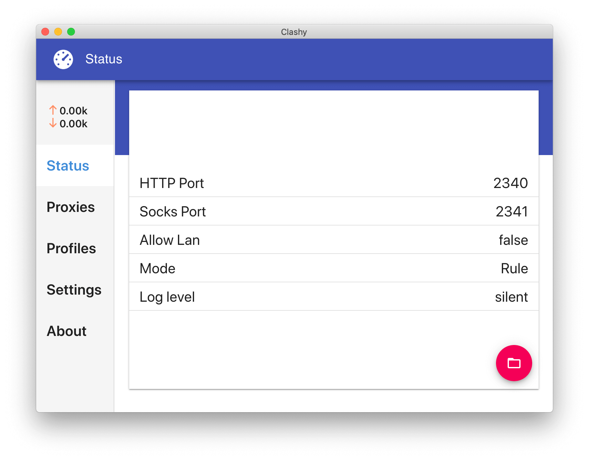
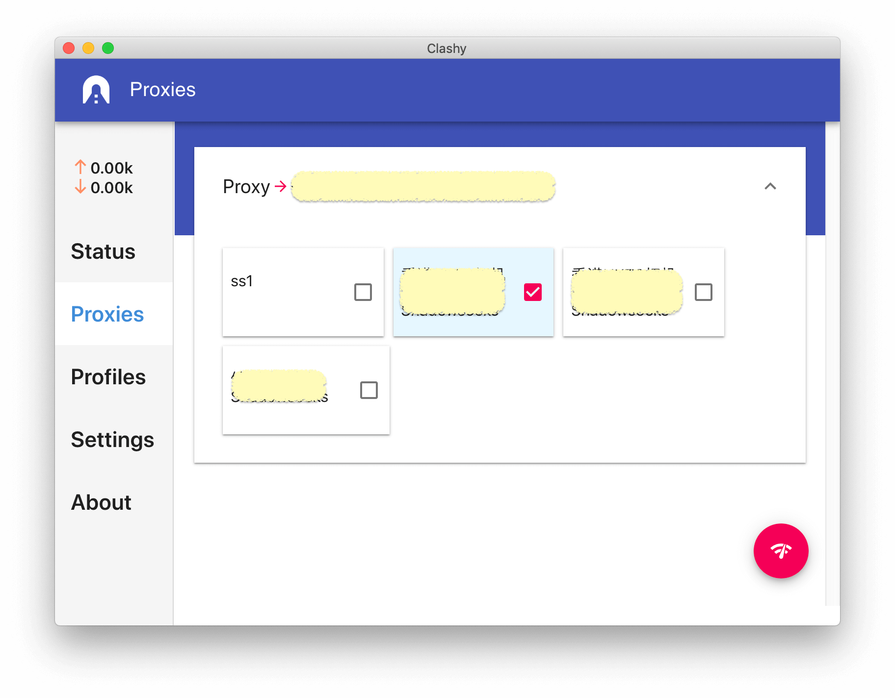
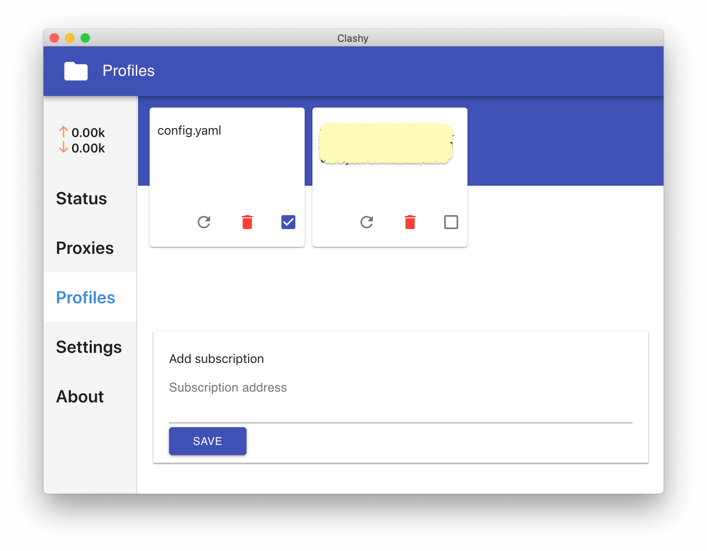
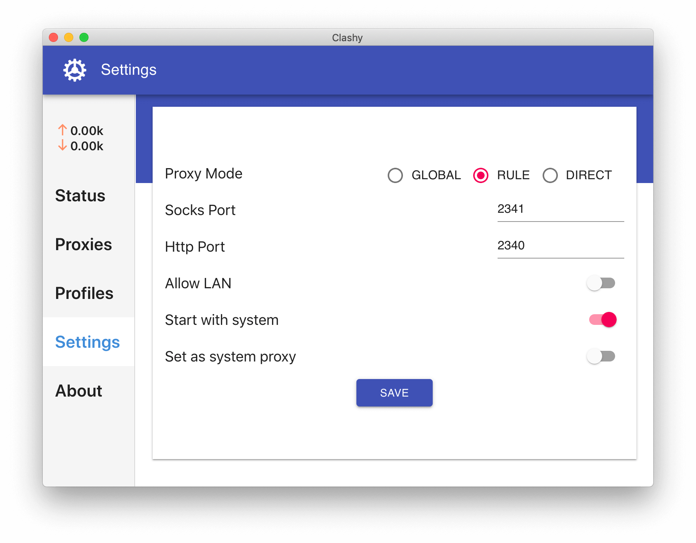

<h1 align="center">
  
   
  Clashy
   
</h1>

A GUI proxy client for Windows / macOS / Ubuntu Desktop based on [Clash](https://github.com/Dreamacro/clash) and [Electron](https://electronjs.org/)

## Features

- Easy to use interface.
- Build-in Clash binary.
- GUI configuration.
- Remote subscription support.
- Server speed test.
- Set as system proxy (Windows & macOS only).
- Start with system.

## Installation
Download latest release from [Release Page](https://github.com/SpongeNobody/Clashy/releases)

## Screenshots

|    |    |
| ------------------------------------------------------- | --------------------------------------------------------- |
|  |  |

## Build

- Clone this project & run `yarn install`
- Run `node pre-build.js` to download clash binary for **current** platform.
- Run `yarn start` to start dev server for webpage.
- Run `yarn start:electron` to start electron main process. Or hit run button in `VSCode`.

## Pack
- Run `yarn run pack` and wait.

## Configuration

- Where is my configuration files & how can I modify them?

  To check your configuration files for `Clash` & `Clashy`, click on the folder icon in status panel. `Clash` configuration file folder will opened automatically and navigate to parent folder you will see  `Clashy` configuration files named `clashy-configs`.

- Can I change clash external controller port & secrets in configuration file?

  You can but you need to modify `Clashy`'s source code to make it work.

## Roadmap & TODOs

- [x] Auto update
- [x] ~~Post build script to zip binaries~~
- [ ] Logout current clash client
- [ ] Use external clash binary
- [ ] Login interface for external clash binary
- [ ] Clash binary update
- [ ] View Clash logs
- [ ] Subscription auto-update

## Contribution
Any pull request is welcome.

## FAQ

### Is this a copycat of [ClashX](https://github.com/yichengchen/clashX) or [Clash for Windows](https://github.com/Fndroid/clash_for_windows_pkg)?

Not exactly. I've been using ClashX for several months and I like it. It's easy to use and nicely designed. But I also need a decent Clash client on my Ubuntu Desktop. And the interface must be easy enough for anyone to use because I don't want to teach my wife how to edit proxy rules or how to use remote configuration files. So I decide to make my own Clash GUI client. I did NOT take any code or assets from those two projects but they did give me some ideas about interface design and implementation.

### I don't like Electron.
Me either.

### How can I check `Clash`'s logs in `Clashy` ?
You can't for now. Visit `127.0.0.1:2390/logs` for Clash logs.